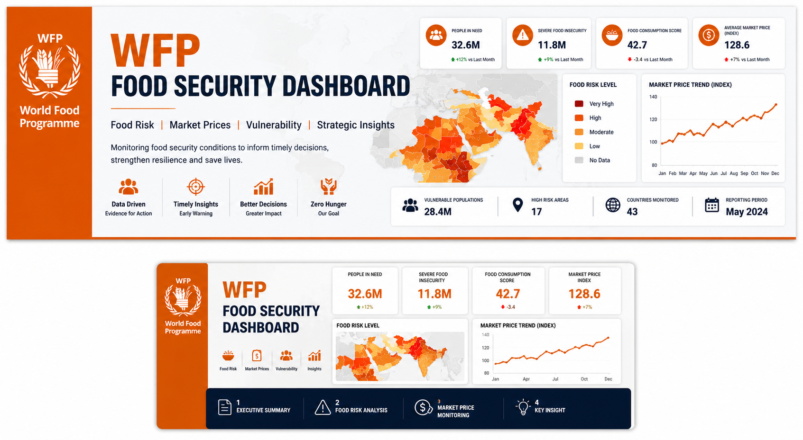
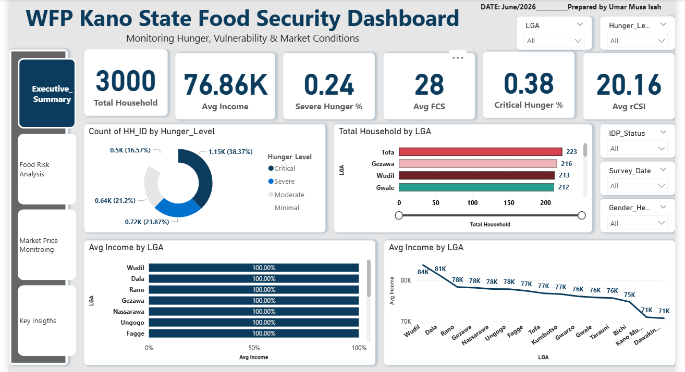
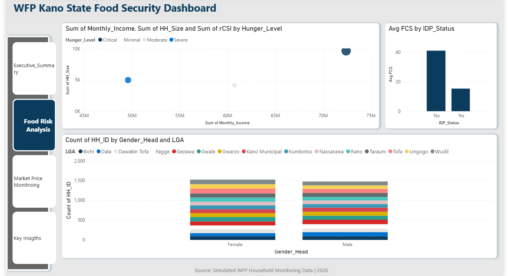
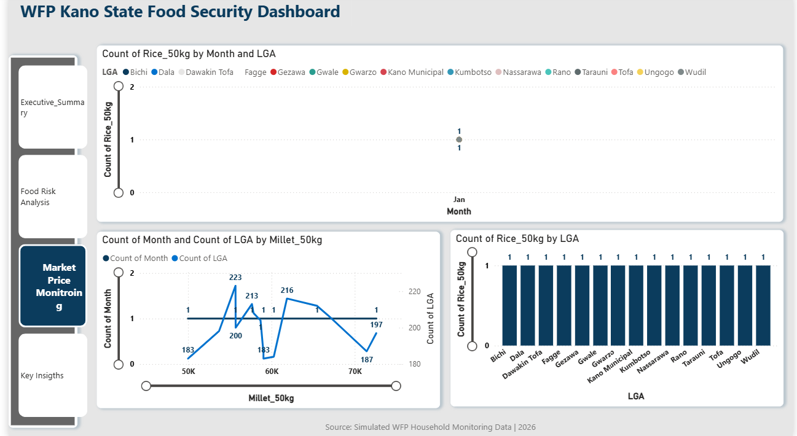
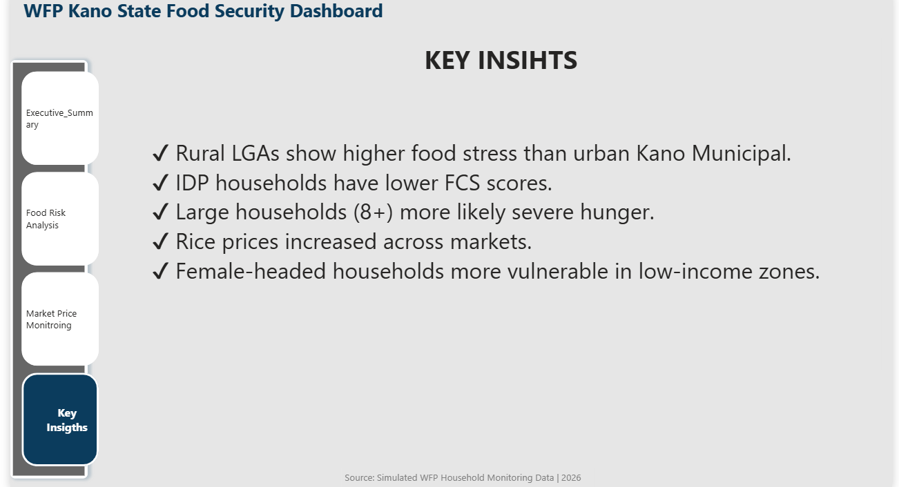

# wfp-food-security-dashboard

# WFP Food Security Dashboard


---

## Project Overview

The WFP Food Security Dashboard is a business intelligence solution designed to monitor food security indicators across vulnerable regions. The dashboard tracks food risk levels, market price fluctuations, and key operational insights to support humanitarian response planning.

Its purpose is to enable faster, evidence-based decisions in resource allocation, emergency response, and food assistance prioritization.

---

## Business Problem

Humanitarian organizations often face major challenges in:

- Monitoring food insecurity trends  
- Detecting high-risk regions early  
- Tracking market price inflation  
- Identifying vulnerable populations  
- Prioritizing emergency interventions  

Without centralized analytics, early response becomes slower and less effective.

---

## Project Objectives

This dashboard was built to:

- Monitor food security KPIs  
- Identify high-risk areas  
- Analyze food vulnerability patterns  
- Track market price changes  
- Support intervention planning  

---

## Dataset Information

| Metric | Value |
|-------|-------|
| Domain | Food Security Monitoring |
| Organization Type | WFP-style NGO Dataset |
| Dataset Type | Simulated / Portfolio Dataset |
| Format | Excel |
| Dashboard Tool | Power BI |

---

## Tools Used

- Microsoft Excel  
- Power BI  
- Power Query  
- Data Cleaning Techniques  
- Dashboard Design  
- Reporting & Presentation  

---

## Data Cleaning Process

The following preprocessing steps were performed:

- Removed duplicate records  
- Standardized regional names  
- Cleaned missing values  
- Corrected category inconsistencies  
- Validated risk scoring metrics  
- Prepared analytical model for Power BI  

---

## Dashboard Preview

### Executive Summary


### Food Risk Analysis


### Market Price Monitoring


### Key Insight


---

## Key Insights

### 1. High-Risk Food Insecurity Zones
Several regions showed elevated food insecurity risk, requiring urgent monitoring.

### 2. Market Price Volatility
Staple food prices increased significantly in some markets, reducing household purchasing power.

### 3. Vulnerable Population Exposure
Low-income households were disproportionately affected by price shocks.

### 4. Intervention Priority Areas
Certain regions required immediate food assistance and targeted support.

---

## Recommendations

Based on the analysis:

- Prioritize aid in high-risk regions  
- Increase frequency of market price monitoring  
- Strengthen early warning systems  
- Deploy targeted food assistance  
- Improve vulnerability tracking  

---

## Deliverables

✔ Interactive Power BI Dashboard  
✔ Cleaned Dataset  
✔ Project Summary PDF  
✔ Analytical Report  
✔ Presentation Deck  
✔ Portfolio Case Study  

---

## Repository Structure

```bash
wfp-food-security-dashboard/
│
├── data/
├── docs/
├── dashboard/
├── presentation/
└── assets/
```

---

## Business Impact

This dashboard demonstrates how data analytics can improve food security monitoring by transforming raw humanitarian data into actionable intelligence for operational and strategic decision-making.

---

## Author

**Umar Musa Isah**  
Data Analyst | Monitoring & Evaluation Professional | Dashboard Specialist

Email: umarmusapress@gmail.com  
GitHub: https://github.com/UmarMusaIsah

---

> Turning humanitarian data into life-saving decisions.
